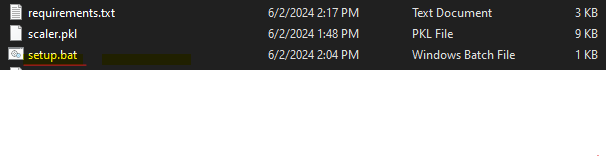

# Python + Flask

This is a complete project built on top of Python's framework Flask includes SVM Model.

## To configure this in your local machine

```txt
altair==5.3.0
attrs==23.2.0
blinker==1.8.2
cachetools==5.3.3
certifi==2024.2.2
charset-normalizer==3.3.2
click==8.1.7
colorama==0.4.6
contourpy==1.2.1
cycler==0.12.1
Flask==3.0.3
Flask-Cors==4.0.1
fonttools==4.52.4
gitdb==4.0.11
GitPython==3.1.43
idna==3.6
imageio==2.34.1
itsdangerous==2.2.0
Jinja2==3.1.4
joblib==1.4.2
jsonschema==4.22.0
jsonschema-specifications==2023.12.1
kiwisolver==1.4.5
lazy_loader==0.4
markdown-it-py==3.0.0
MarkupSafe==2.1.5
matplotlib==3.9.0
mdurl==0.1.2
networkx==3.3
numpy==1.26.4
opencv-python==4.9.0.80
packaging==24.0
pandas==2.2.1
pillow==10.3.0
protobuf==4.25.3
pyarrow==16.1.0
pydeck==0.9.1
Pygments==2.18.0
pyparsing==3.1.2
python-dateutil==2.9.0.post0
pytz==2024.1
referencing==0.35.1
requests==2.31.0
rich==13.7.1
rpds-py==0.18.1
scikit-image==0.23.2
scikit-learn==1.5.0
scipy==1.13.1
six==1.16.0
smmap==5.0.1
tenacity==8.3.0
threadpoolctl==3.5.0
tifffile==2024.5.22
toml==0.10.2
toolz==0.12.1
tornado==6.4
typing_extensions==4.12.0
tzdata==2024.1
urllib3==2.2.1
watchdog==4.0.1
Werkzeug==3.0.3
```

## Run in your working directory of that project

```cli
1- python -m venv .venv

2- .venv\Scripts\activate

3- pip install -r requirements.txt
```

This will automatically create, activate and install all dependencies mentioned in requirements.txt file

## Another way to your dependencies is to just double click your setup.bat file in your folder



## To update your requirements.txt file RUN

```cli
- pip freeze > requirements.txt
```

## To Run Project

```cli
- flask --app main run
```
